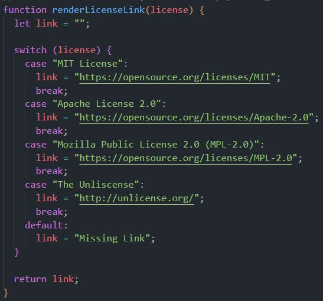
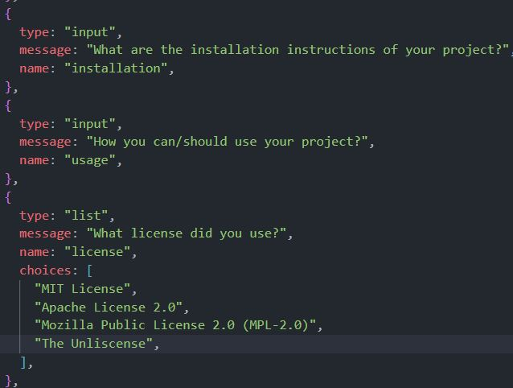
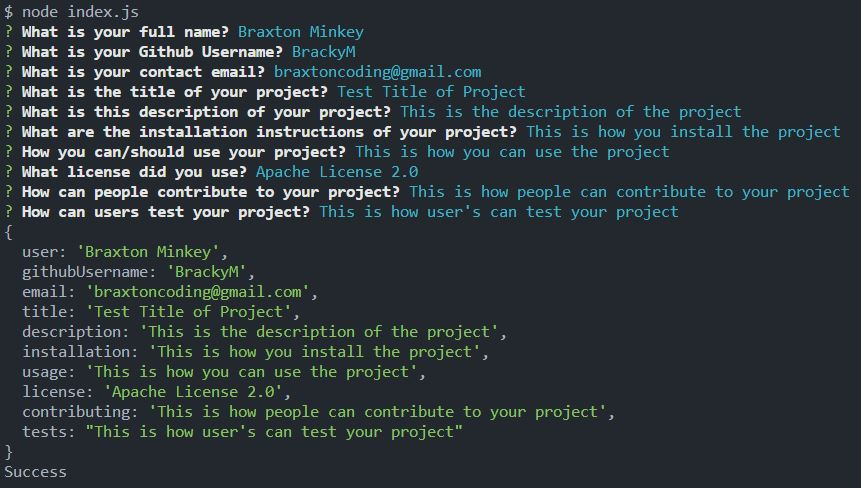

# Braxton M | UCBC9_README_Generator | README

The objective of the README.md Generator is to use the ability of Node.JS to create a markdown file for a user based
on the inqurier package. We were given starter code with the set up of the files but ultimately created the Javascript ourselves.
The user would run the application with the "node index.js" command and be prompted with questions that would fill out
pre-determined sections of their README.md file to simplifiy the creation for the user. I prompted the user with questions that would
auto-generate links and license badges that the user can select.

The file created is the "GeneratedREADME" file


## Acceptance Criteria


```md
GIVEN a command-line application that accepts user input
WHEN I am prompted for information about my application repository
THEN a high-quality, professional README.md is generated with the title of my project and sections entitled Description, Table of Contents, Installation, Usage, License, Contributing, Tests, and Questions
WHEN I enter my project title
THEN this is displayed as the title of the README
WHEN I enter a description, installation instructions, usage information, contribution guidelines, and test instructions
THEN this information is added to the sections of the README entitled Description, Installation, Usage, Contributing, and Tests
WHEN I choose a license for my application from a list of options
THEN a badge for that license is added near the top of the README and a notice is added to the section of the README entitled License that explains which license the application is covered under
WHEN I enter my GitHub username
THEN this is added to the section of the README entitled Questions, with a link to my GitHub profile
WHEN I enter my email address
THEN this is added to the section of the README entitled Questions, with instructions on how to reach me with additional questions
WHEN I click on the links in the Table of Contents
THEN I am taken to the corresponding section of the README
```

## Screenshots

There are no screenshots of the deployed application since it's ran through the console. A video is provided of the application being used.

JavaScript Screenshots

* Screenshot 1: Selecting a License Link



* Screenshot 2: Example Questions users will be asked



* Screenshot 3: Console Results of the Video Demonstration



## Assignment Links

- [Tutorial Video](https://drive.google.com/file/d/1RF4dJNbZtg520rrUcZWNbl-hOlDTMvAA/view)
- [Github Project Repository](https://github.com/BrackyM/UCBC9_README_Generator)


##  Contributors / Resouces Used
    
UC Berkley Tutoring 
